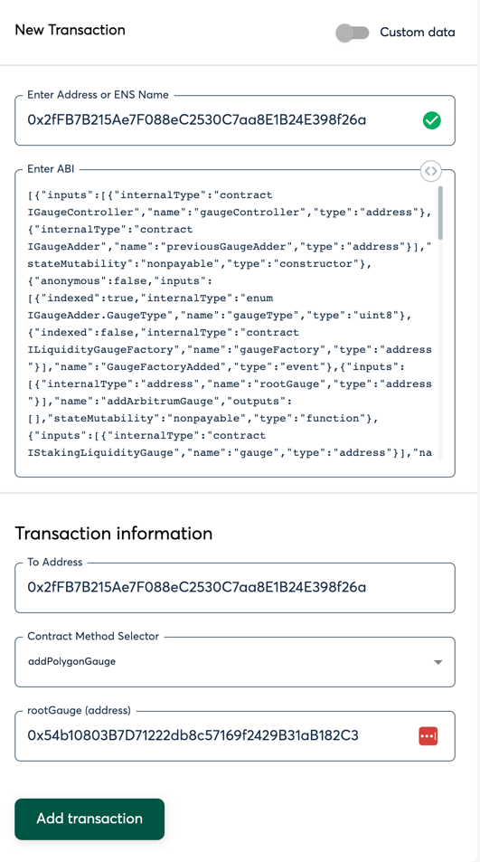
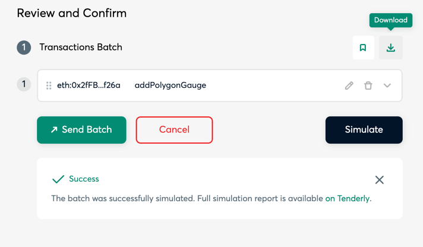

# Adding a New Gauge to the Gauge Controller

Go To: https://gnosis-safe.io/app/eth:0xc38c5f97B34E175FFd35407fc91a937300E33860/apps?appUrl=https://apps.gnosis-safe.io/tx-builder

- Set Address to 0x2fFB7B215Ae7F088eC2530C7aa8E1B24E398f26a
- Select `Add___Gauge` where ___ is the chain the gauge is being added for
- Enter the mainnet address of the Gauge (Not the Pool) being added
- Click `Add Transaction`
- 
- Click `Create Batch`
- Simulate and verify
- 
- Click the Download on the top right.
  - Name the saved file `BIP-XXX.json`
- Create a PR adding your BIP-XXX.json to the [BIPs folder of the BalancerMaxis Github repo](https://github.com/BalancerMaxis/multisig-jsons/tree/main/BIPs)

### For Github Noobs

- Go here: https://github.com/BalancerMaxis/multisig-jsons/upload/main/BIPs
- Upload your BIP-XXX.json file with the proper BIP number
- Copy the title of the BIP in Commit Changes section where it reads `Add files via Uplaod` in grey
- Ensure that you select the `Create a New Branch for this Commit and start a pull request` option
  - Name the brance BIP-XXX where XXX is the number of your BIP
- Click `Propose Changes` 

- Click `Create Pull request`

**The resulting link which should look something like this: https://github.com/BalancerMaxis/multisig-jsons/pull/1 is the PR link that you should include in the body of the snapshot text.**
