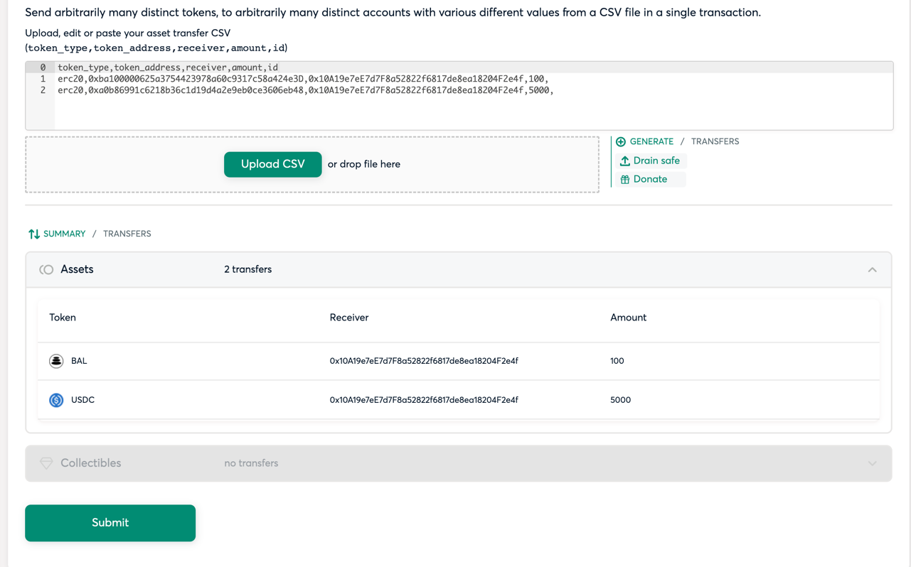
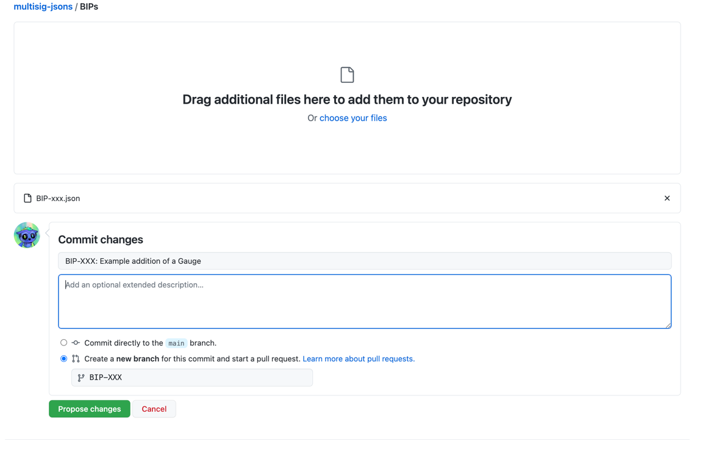
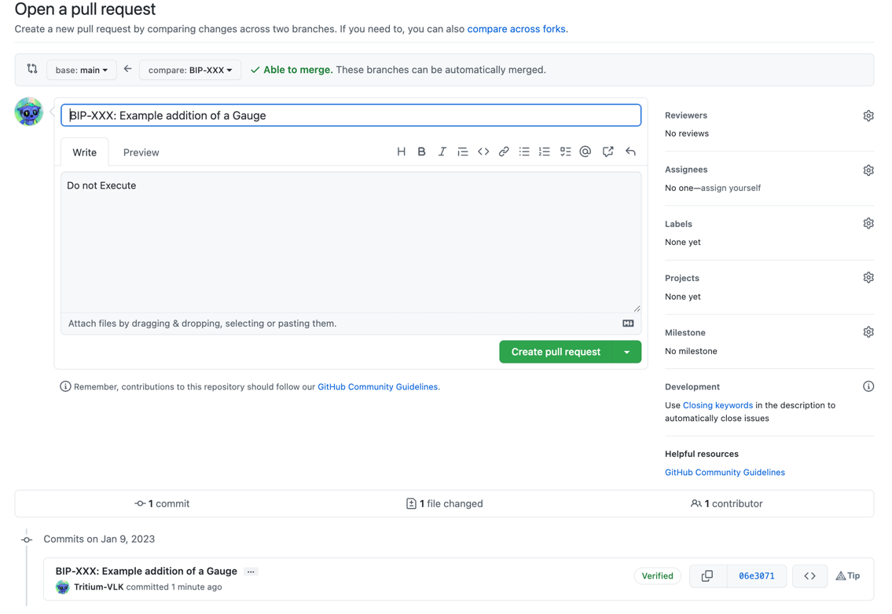

# Sending funds to the DAO multisig to fund a SP
The easiest payload for transfers is an CSV Airdrop file.

Create an Gnosis Airdrop CSV file and create a PR to add it to this repo as `/BIPs/BIP-XXX.csv` where XXX is the number of your BIP
## Build your Payload - Instructions
### CSV Airdrop App
The csv has a format of: `token_type,token_address,receiver,amount,id` Where token_type should be erc20 and id can be blank.

The following line sends 100 BAL to `0x10A19e7eE7d7F8a52822f6817de8ea18204F2e4f`:
> erc20,0xba100000625a3754423978a60c9317c58a424e3D,0x10A19e7eE7d7F8a52822f6817de8ea18204F2e4f,100,

The following line sends 5000 USDC to `0x10A19e7eE7d7F8a52822f6817de8ea18204F2e4f`:
>  erc20,0xa0b86991c6218b36c1d19d4a2e9eb0ce3606eb48,0x10A19e7eE7d7F8a52822f6817de8ea18204F2e4f,5000,

The`BIP-XXX.csv` file in this same directory when uploaded will therefore send 100 BAL and 5000 USD to `0x10A19e7eE7d7F8a52822f6817de8ea18204F2e4f`

Note that it's first line is a header line, and there are no new lines after the last row of data.

### Prepairing your CSV payload and testing it

- Copy the BIP-XXX.csv somewhere easy to find and name it after your BIP number.
- Go to the [CSV Airdrop APP on the DAO Multisig](https://gnosis-safe.io/app/eth:0x10A19e7eE7d7F8a52822f6817de8ea18204F2e4f/apps?appUrl=https://cloudflare-ipfs.com/ipfs/QmUFKPZSn73LiwznQ3PVWQXpcaWVdYrSM6c5DES2y24EYd)
- Upload the CSV you just prepared.
- Click on the Assets header to drill down and see a list of all the funds that will be transferred.

- If this looks right, stop.  Your csv is ready for a PR.

### For Github Noobs

- Go here: https://github.com/BalancerMaxis/multisig-jsons/upload/main/BIPs
- Upload your `BIP-XXX.csv` file with the proper BIP number
- Copy the title of the BIP in Commit Changes section where it reads `Add files via Uplaod` in grey
- Ensure that you select the `Create a New Branch for this Commit and start a pull request` option
  - Name the brance BIP-XXX where XXX is the number of your BIP
- Click `Propose Changes` 

- Click `Create Pull request`

**The resulting link which should look something like this: https://github.com/BalancerMaxis/multisig-jsons/pull/1 is the PR link that you should include in the body of the snapshot text.**
