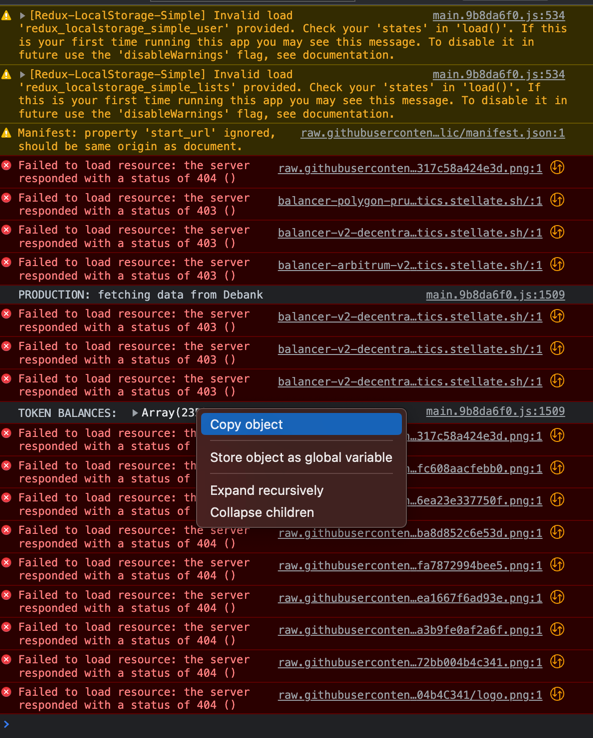

## Generate Github Actions Fee Sweep JSON
Files here are read by github actions and transformed into transaction builder json files in the out directory.

In order to trigger a run, the Sweep Fees label must be set on PR, and the files must be named starting with YYYY-MM-DD of the current day

### Steps to use

####Get Source Data
- Go to https://balancer.defilytica.com/. 
- Select a chain.  
- Click Protocol Revenue.
- once it is done loading, open the JavaSCript console in your browser.  Find the Token Balances Object that looks like this and copy it to your clipboard:

- Copy the contents of this file into a file in this directory named like YYYY-MM-DD-chain.json
  - Note that year must be 4 digit and day and month always 2 with a leading 0
  - Note that -chain is just to allow for 3 different files for 3 different chains, all JSON files with YYYY-MM-DDD of today in this file will be processed
  - Note that updates overwrite, so if you push 2 files with data for the same chain they will be overwritten.
- Push all of your changes to a new branch, create a pull request with the label Sweep Fees
  - Note that the label must be set before the PR is created for the action to trigger.
- Note that the funds are currently all swept into the LM multsig.

With any luck, once the PR is commited, the action should run and build resulting output files in the out/ dir.

### Recommended process

- Each Sunday, grab outputs for all 3 chains and save them to this directory.
- Validate outputs, adjust as needed (this was a human process before)
- 