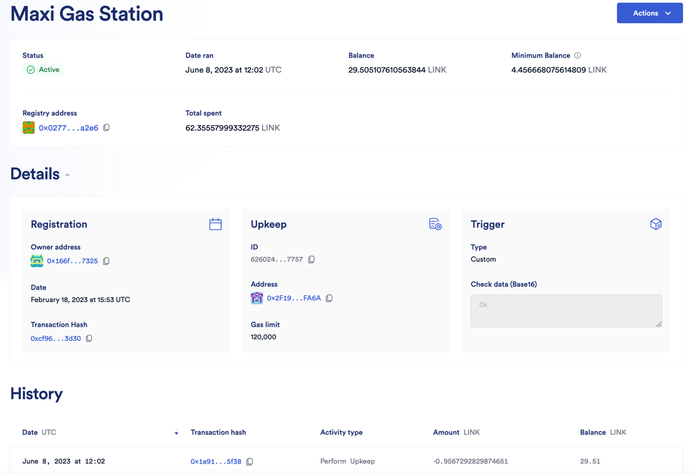

# Maxi Automation - Chainlink Keepers
The maxis use the chainlink keeper pattern often to automate regular onchain work or maintain stuff.  Everything is described here.

## About Chainlink Automation
- You can find docs here.  We tend to use the custom logic pattern: https://docs.chain.link/chainlink-automation/introduction
- To run a keeper you pay LINK into the chainlink registry which is burnt to cover gas costs.  The keeper will not keep running if there is not enough link.
  - Anyone can fund any upkeep, by paying in more LINK.  This means that keepers are in some sense no-stop.

## List of Keepers
A list of keeper contracts and their chainlink automation UUID is stored in [activeKeepers.json](./activeKeepers.json)

To pull up an automation on chainlink go to:
https://automation.chain.link/*{CHAIN}/{UUID}, for example the for the maxiGasStation: https://automation.chain.link/mainnet/62602467182204477380138952081172885895406053754821061796893606503759482417757

## Understanding the automation view
Here is a screenshot of the maxiGasStation link above:

Min Balance is the min amount of link required to try the next upkeep. It is not how much it will cost, but a safeguard to make sure way more gas isn't spent than there is link in the contract.  The rest up top should be clear. 

The details page shows the contract address, the owner of the chainlink regsitration (who can stop it and pull back any link), and some info about the contract.

In the history section you can see a history of link payments and calls made to the keeper.

## When does it run
Each contract defines run conditions.  LINK will only be spent when on-chain execute is called as a result of these condtions being met.  In each case these condtions are different.  You should check the docs.  Many contracts require funding to be in place, and have a time based element.  Time based elemetns can either be internal, or based on understanding time from the state of other contracts (like gauge epochs)

Each upkeep should be documented here, with an md file that has the same name as the keeper in the json.  It should describe the run conditions, and how to check if it is working.

    

