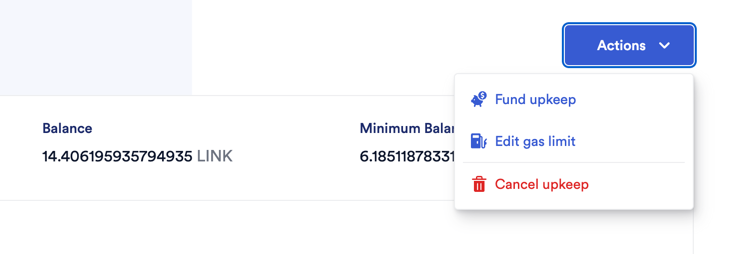

## The Maxi Gas Station - Chainlink Automation

#### Note that this facility is currently only operational on mainnet and everything here refers to that

The Maxi Gas Station was provisioned under [this PR](https://github.com/BalancerMaxis/multisig-ops/pull/77)

The [GasStation contract](https://etherscan.io/address/0x2F1901f2A82fcC3Ee9010b809938816B3b06FA6A) holds ETH, and manages the configuration about when gas needs to be paid out.

The Chainlink automation page describing chain links interaction with this contract to automate can be found [HERE](https://automation.chain.link/mainnet/62602467182204477380138952081172885895406053754821061796893606503759482417757).  You can also top up link needed to cover the costs of triggering the contract.


The chainlink side of the automation can be found here: 
The list of watched addresses that may be refilled can be found by calling  `GetWatchList` on the [Maxi GasStation contract](https://etherscan.io/address/0x2F1901f2A82fcC3Ee9010b809938816B3b06FA6A#readContract).

The specific parameters for a given watchlist address can be found by calling `getAccountsInfo(address)` for an address on the watchlist.  The outputs look like this:
```
[ getAccountInfo(address) method Response ]
  isActive   bool :  true
  minBalanceWei   uint96 :  500000000000000000
  minTopUpAmountWei   uint96 :  200000000000000000
  lastTopUpTimestamp   uint56 :  1676923715
```
**Min Balance:** defines the target minimum ETH balance for this address.
**minTopupAmount:** defines the minimum amount of ETH that will be sent as part of a topup.

In the configuration above 0.5 ETH minBalance and 0.2 minTopUp means that the this wallet will be topped up when it has under 0.3 ETH to always have 0.5 ETH.

The watchlist can be updated using the setWatchList command.

### It's not working, what could be wrong.
Check the [Automation Page](https://automation.chain.link/mainnet/62602467182204477380138952081172885895406053754821061796893606503759482417757) and make sure there is enough LINK.  If not you can use the button to fund the upkeep with more.


Check the [GasStation contract](https://etherscan.io/address/0x2F1901f2A82fcC3Ee9010b809938816B3b06FA6A): 

- Does it have enough ETH?  0.5 will always be enough for 1 upkeep?  Just send ETH to the contract to fund with more.
- does the read function `checkUpkeep("0x")` return TRUE with some calldata, if so then LINK should be linking.
- Has it been under minWaitPeriod(read function) since the address needing was last topped up?

If you still haven't figured out what is wrong, talk to Tritium and/or take a minute to think about the watchlists and the current state of things.

Check Upkeep will not return True unless the following reasonably selfExplanitory if statement returns true:

```solidity
        if (
          target.lastTopUpTimestamp + minWaitPeriod <= block.timestamp &&
          balance >= delta &&
          delta >= target.minTopUpAmountWei
        ) 
```

### How can I learn more about chainlink automation
[DOCS](https://docs.chain.link/chainlink-automation/introduction)