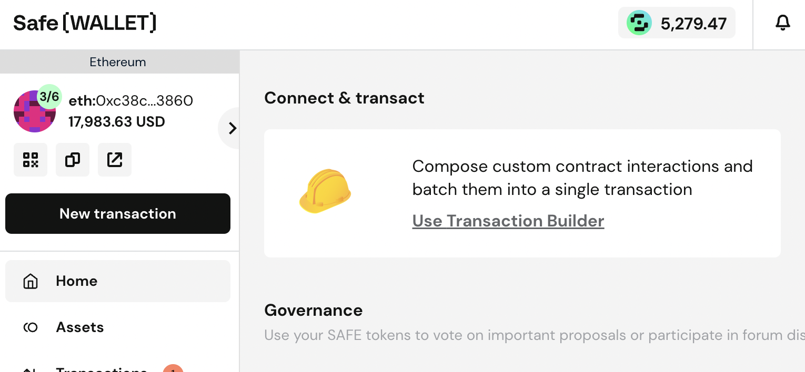
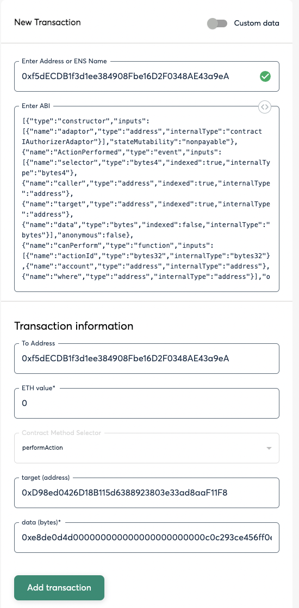
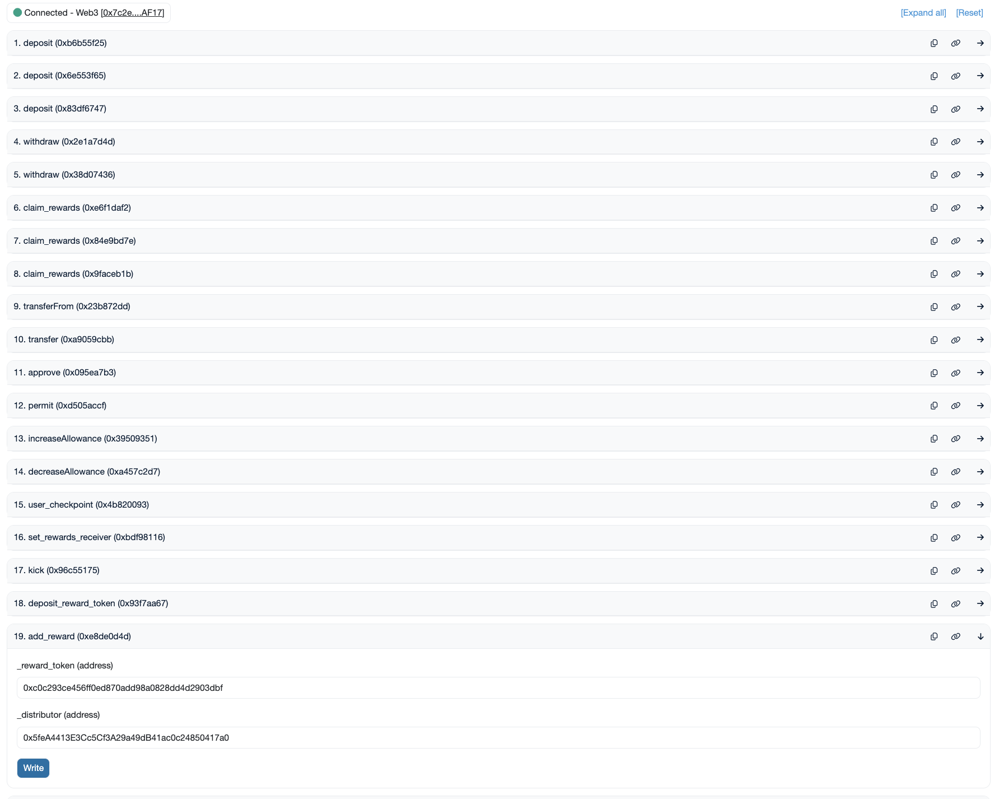
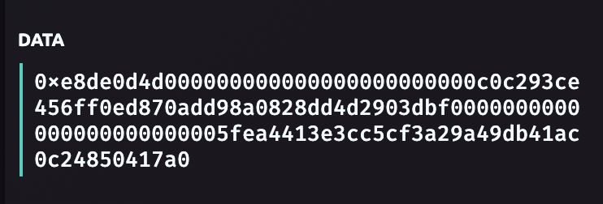

## Using the add_reward function 

### Purpose

The add_reward function is a writable function on all mainnet and child chain gauges in the veBAL system. The purpose of the function is to permit a token other than BAL to be streamed onto a gauge where users can stake their pool tokens to receive a portion of the rewards. 

- Per Aura there is an actual limit of 8 reward tokens on their side, 2 of which are BAL and AURA meaning 6 total can be added. It is suggested no more than 2 additional reward tokens are added due to conflict on the Aura contracts when this amount is exceeded. If 3 or more rewards are added to be streamed on a gauge on Balancer, it is suggested that AURA is also added to the rewards of that gauge. 
- AURA token address on mainnet: 0xc0c293ce456ff0ed870add98a0828dd4d2903dbf
- Aura Distributor multisig on mainnet: 0x5feA4413E3Cc5Cf3A29a49dB41ac0c24850417a0 for other networks please check with Aura if this address is valid. 

### How to add a reward token

The steps to adding a reward token involve several prequisites.

1. Confirm the multisig the transaction will be sent from has the proper [permissions](https://docs.balancer.fi/reference/authorizer/mainnet.html). At the time of writing the add_reward permission on LiquidityGaugev5 is needed. This multisig may be different across various networks. 

2. When executing the transaction the most utilzied method is to go the the gnosis safe interface "Use Transaction Builder" 

3. Once on the transaction builder interface, you must confirm the AuthorizerAdapterEntrypoint contract on your respective network. This can be done via Balancer's [documents](https://docs.balancer.fi/reference/contracts/deployment-addresses/mainnet.html#authorization) or the [defilytica contract map](https://defilytica.tools/#/balancer/governanceMap). 

4. For mainnet the AuthorizerAdapterEntrypoint is 0xf5dECDB1f3d1ee384908Fbe16D2F0348AE43a9eA. The only function that can be executed is performAction. For inputs there will be the following:
- ETH Value: Always equal to "0"
- target(address): This will be the child chain gauge of the pool which is meant to receive rewards. On mainnet it is just the mainnet gauge address.

- data(bytes): See step 5. 

5. Depending on the wallet used this step will vary slightly, but the goal is to simulate an add_reward function via an EOA and retrieve the proper data from that transaction. Note that this transaction will be rejected. Firstly, go to the etherscan or equivalent site for the gauge you are adding a reward for. 

Then go to the "Contract" section and click "Write" or "Write Contract as Proxy". Depending on the network you are on the add_reward function will be. Here there will be two address requirements to input
- _reward_token: The address of the token which will be streamed to the gauge
- _distributor: The contract which will send rewards to the gauge, this can be an EOA, a SAFE, a rewards injector contract, or another injector contract. The address must be agreed upon with the partner who is sending rewards as all strategies will vary and injectors do not exist for all possible reward tokens.

Once you have your _reward_token and _distributor addresses defined, connect your wallet, enter the addresses into their respective cells and click "write"

In your wallet interface you can examine the data which this transaction would entail and copy that text to place in the data(bytes) section of the SAFE Transaction builder.

Once the data is copied and placed into the SAFE transaction builder data(bytes) cell then transaction in your EOA can be rejected. You can the proceed with creating the transaction batch in the safe and simulating on tenderly.