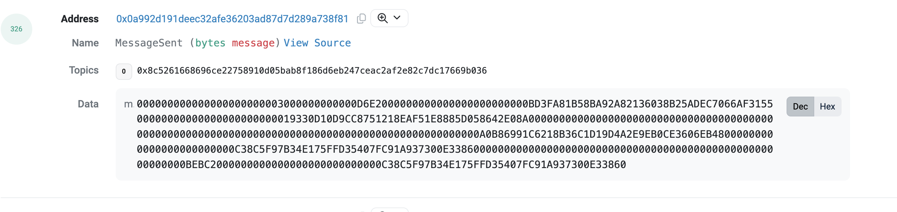
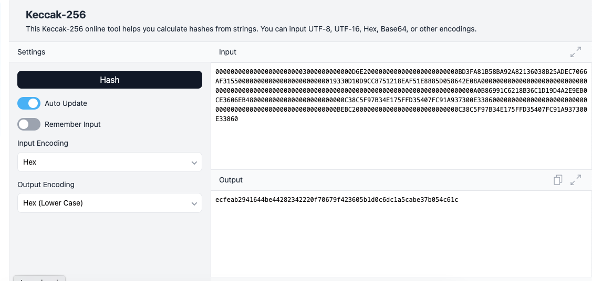
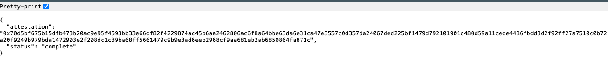

## Claiming CCTP Bridge Transactions on L2s

### Purpose

Primarily for USDC the Balancer Maxis utilize their incentive handling multisigs to bridge funds from Ethereum Mainnet to layer 2 networks such as Arbitrum and Base for distribution. In order to do so multisigs must interact with a CCTP message sender on mainnet, and a message receiver contract on the destination network. This is made incredibly simple to generate due to Xeonus' creation of the operations UI for the message sending half of the process: https://balancer.defilytica.tools/payload-builder/cctp-bridge.

In order to claim these funds, the transaction on chain is somewhat complex to build from scratch. This documentation is meant to outline the key steps in that claiming process.

### How to claim / receive a CCTP message

Assuming a message has been sent from Mainnet to a layer 2 network, the transaction can be made via the gnosis safe transaction builder by doing the following:

1. Confirm the address for the CCTP [MessageTransmitter](https://developers.circle.com/stablecoins/evm-smart-contracts#messagetransmitter-mainnet) contract. This address will apply to your L2 transaction. For Arbitrum you would write 0xC30362313FBBA5cf9163F0bb16a0e01f01A896ca 

2. Once in safe interface on the proper network and the MessageTransmitter contract is entered, the abi will prompt you with several options. Select receiveMessage from the dropdown. This will prompt you to fill in two pieces of information, the message(bytes), and the attestation(bytes).

3. To retrieve the message, go to the sent transaction from Ethereum Mainnet and click Logs to view the event log. We will use an already claimed transaction for this example. The page will look like [this](https://etherscan.io/tx/0x3203fa6e0f6bfe9f78b7179f2d8611168b5488e7e6e870f645cd7e27920b50ec#eventlog) and you can search for the MessageSent section. The Data in this section can be entered as the "message" with "0x" prepending the data.

Resulting message entry: 0x000000000000000000000003000000000000D6E2000000000000000000000000BD3FA81B58BA92A82136038B25ADEC7066AF315500000000000000000000000019330D10D9CC8751218EAF51E8885D058642E08A000000000000000000000000000000000000000000000000000000000000000000000000000000000000000000000000A0B86991C6218B36C1D19D4A2E9EB0CE3606EB48000000000000000000000000C38C5F97B34E175FFD35407FC91A937300E3386000000000000000000000000000000000000000000000000000000000BEBC2000000000000000000000000000C38C5F97B34E175FFD35407FC91A937300E33860

4. The attestation can be acquired by generating the keccack-256 of the message. To do so, go to this [site](https://emn178.github.io/online-tools/keccak_256.html) and be sure your input encoding is in HEX and your output is in Hex (Lower Case). The input must be the data from the event logs. This is the same as the message entry above, but without the 0x added to the front of the text.

Output: ecfeab2941644be44282342220f70679f423605b1d0c6dc1a5cabe37b054c61c

With your acquired output, you can retrieve your attestation by using this website from Circle:

https://iris-api.circle.com/v1/attestations/0x

To view your attestation you must add the hex generated to the end of the link above, in this case the final link would be:

https://iris-api.circle.com/v1/attestations/0xecfeab2941644be44282342220f70679f423605b1d0c6dc1a5cabe37b054c61c

Which yields the following: 

"attestation": "0x70d5bf675b15dfb473b20ac9e95f4593bb33e66df82f4229874ac45b6aa2462806ac6f8a64bbe63da6e31ca47e3557c0d357da24067ded225bf1479d792101901c480d59a11cede4486fbdd3d2f92ff27a7510c0b72a20f9249b979bda1472903e2f208dc1c39ba68ff5661479c9b9e3ad6eeb2968cf9aa681eb2ab6850864fa871c" 

Can be placed into your safe transaction in the attestation section and with these two pieces of data the bridged USDC can be claimed.