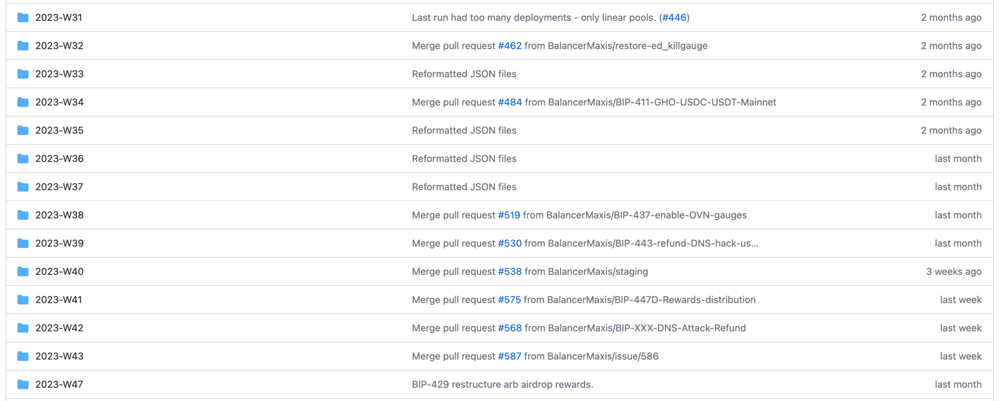

# Multisig Operations Processes

## The Multisigs and signer sets
Balancer maintains a variety of multisigs.  Each execution is intended to somehow link back to governance.

The source of truth for all multisigs and signer addresses [here](https://github.com/BalancerMaxis/bal_addresses/blob/main/extras/multisigs.json).  

DAO multisigs use the DAO signer set, which requires 6/11 signers to execute.
The rest of the safes use the Maxi signer set, which requires 3/6.

### DAO Multisigs
There is one DAO Multisig per chain.  Each execution must be directly linked to approved governance.

The DAO multisig currently operates on a weekly cadence.  Each week the Balancer Maxis facilitate and track the [Governance Process](https://github.com/orgs/BalancerMaxis/projects/1).
In this process, BIPs that are deemed ready for execution have pull-requests with [Safe Transaction-Builder paylaods](https://github.com/BalancerMaxis/multisig-ops/tree/main/BIPs) prepared in a directory structure that grouped by execution weeks. 

[Automated reporting](https://github.com/BalancerMaxis/multisig-ops/blob/main/BIPs/2023-W36/BIP-424.report.txt) is run on each payload, which resolves hard to read addresses and details and makes review easier.
Payloads and reports are reviewed in github and merged.

Once voting for a week has begun, an [action](https://github.com/BalancerMaxis/multisig-ops/actions/workflows/merge_json.yaml) is run to combine all payloads for the current week by multisig.  New reports are generated on the [Combined Payloads](https://github.com/BalancerMaxis/multisig-ops/tree/main/BIPs/00batched) an additional review is conducted.
Here is an [example combined payload report](https://github.com/BalancerMaxis/multisig-ops/blob/main/BIPs/00batched/2023-W43/1-0x10A19e7eE7d7F8a52822f6817de8ea18204F2e4f.report.txt).

Following the end of voting, if any votes are rejected, their payload files are moved the [00rejected](../BIPs/00rejected) directory and the combine action is rerun.  All of the combined payloads are then loaded into the DAO multisigs per chain.  The combined payloads are merged into a final [Signer Report](https://github.com/BalancerMaxis/multisig-ops/blob/main/BIPs/00batched/2023-W42/combined-report.md).  This report as well as links to the safe are sent to signers.  

Another member of the Maxis completes an independent review of the loaded payloads to sanity check and shares a detailed report of what the payload will do with the signers.

Transactions are then signed and executed.

### Operation Multisigs

Many operational flows have been delegated the Maxis to administer.   This includes administration of extra incentive flows and fee distribution and other operational aspects of the DAO.  All of this work is done based on the frameworks set-forth by governance.  With the exception of gauge additions, which follow the DAO multisig process described above,  operational multisig work is completed by the Maxis using a combination of automation found in this repo, hand crafted transaction builder payloads, and various Safe Apps.   Each payload undergoes detailed review my multiple signers.  Complex transactions such as incentive payments are reviewed against artifacts founds in this repo. 

More and more of the operational work is being moved to a payload and report flow.  Artifacts of most of our work can be found in the multisig-ops repo.

Attention is given to ensure that operational Multisigs do not control critical amounts of value nor have dangerous influence over the protocol.

### Emergency SubDAO Multisig

The [Emergency SubDAO](https://forum.balancer.fi/t/form-the-emergency-subdao/3197) is an additional multisig that has the ability to execute some emergency operations such as:

 - Pausing pools from factories that have been launched less than 90 days ago.
 - Putting pools into recovery mode
 - Killing Gauges

The Emergency SubDAO doesn't operate often, but when it does, does so in a war room type situatuion when many members are paying careful attention to what is being done and why.

### What can the Multisigs Do
Detailed information about what permissions exist and who can do what can be found on [DeFilytica](https://forum.balancer.fi/t/form-the-emergency-subdao/3197) or in the [Balancer Docs](https://docs.balancer.fi/reference/authorizer).

Additional information about the [Multisigs](https://docs.balancer.fi/concepts/governance/multisig.html) and the [Balancer Governance Process](https://docs.balancer.fi/concepts/governance/process.html) can also be found in the docs. 